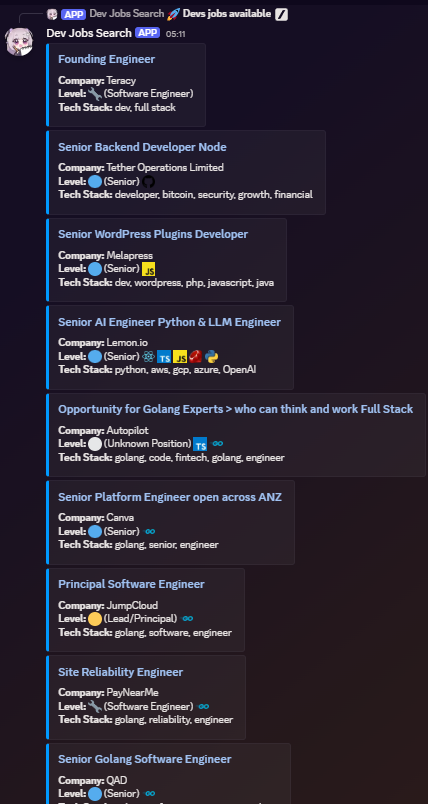
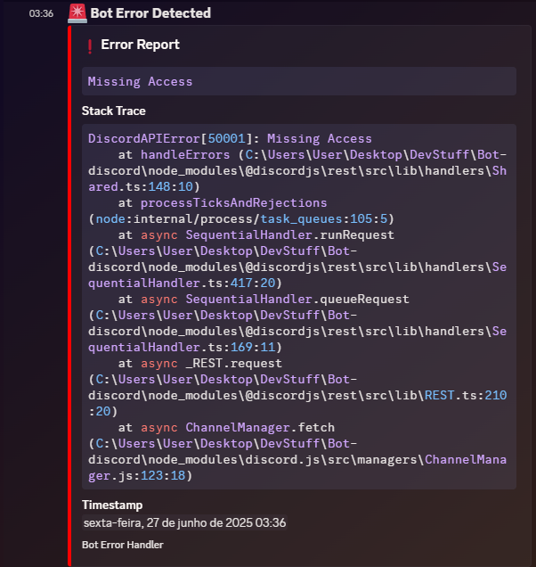

# Discord IT Jobs Bot

A robust, modular Discord bot for fetching and posting IT/developer job listings from remoteOk API (Soon more websites), with features for error reporting, message cleanup, scheduling, and slash command management.

---

## Features

- **Fetches and posts only IT/developer jobs** from supported sources.
- **Tech stack and job level emoji tagging** for easy scanning.
- **Scheduled job posting** every 6 hours (customizable).
- **Message cleanup**: Deletes previous bot messages before posting new jobs, on startup, and via `/clear` command.
- **Slash commands**: `/jobs`, `/clear`, `/trigger-jobs`.
- **Robust error reporting** via Discord webhook.
- **Easy setup and configuration** with environment variables.

---

## Setup

1. **Clone the repository:**

   ```bash
   git clone <your-repo-url>
   cd Bot-discord
   ```

2. **Install dependencies:**

   ```bash
   npm install
   ```

3. **Configure environment variables:**

   - Copy `.env.example` to `.env` and fill in your Discord bot token, channel IDs, and webhook URL.

4. **Register slash commands:**

   ```bash
    ts-node src/types.ts
    # or
   npm run deploy-commands
   ```

   > **Note:** Run this script any time you change or add slash commands.

5. **Start the bot:**
   ```bash
   npm start
   ```

---

## Usage

- `/jobs` — Fetch and post the latest IT jobs.
- `/clear` — Delete all previous bot messages in the channel.
- `/trigger-jobs` — Manually trigger the scheduled job posting.

The bot will also automatically post jobs every 6 hours and clean up its previous messages.

---

## Error Reporting

All errors are reported to a Discord webhook (set `BOT_ERROR_WEBHOOK_URL` in your `.env`). it will Include:

- Error message
- Stack trace
- Timestamp

## Visual Examples

### Job Posting Example



### Error Reporting Example



## Customization

- **Job filtering**: Edit `src/api/fetchJobs.ts` and `src/utils/jobUtils.ts` to adjust job sources or filtering logic.
- **Scheduling**: Change the schedule in `src/scheduler.ts` as needed.
- **Slash commands**: Update `src/types.ts` and re-run the deploy script.

---

## new Features in Progress

- **Support for more job sources**: Integrate additional job boards.
- **Enhanced error handling**: More detailed error reporting and logging.
- **Improved job filtering**: More advanced filtering options based on user preferences.
- **database support**: Store job listings and user preferences in a database for persistence.

---

## Contributing

Pull requests and suggestions are welcome!

---

## License

MIT
